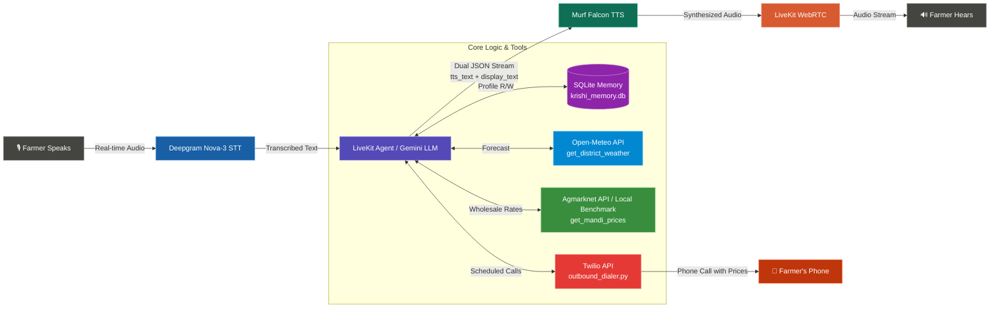

# 🌾 Krishi Mitra — AI Voice Advisor for Indian Farmers

**Krishi Mitra (कृषि मित्र)** is a production-grade, real-time multilingual voice AI assistant built specifically for Indian farmers. Powered by **Murf Falcon TTS**, **LiveKit Agents SDK**, **Deepgram Nova-3 STT**, **Google Gemini 3.1 Flash Lite LLM**, **SQLite Persistent Memory**, **Real-Time External APIs** (Open-Meteo Weather + Government Agmarknet Mandi Prices), and **Twilio Outbound Phone Call Scheduling**.

[](https://opensource.org/licenses/MIT)
[](https://murf.ai/api/docs/text-to-speech/streaming)
[](https://docs.livekit.io)
[](https://nextjs.org/)
[](https://www.python.org/)

---

## 🚀 Key Capabilities

- 🗣️ **Natural Multilingual Voice Interaction**: Communicates fluently in **English**, **Devanagari Hindi**, and **Bengali** with 100% strict language-matching rules.
- ⚡ **Ultra-Low Latency Speech Pipeline**: Powered by Murf Falcon TTS (55ms latency) and Deepgram Nova-3 STT with Silero VAD turn detection for smooth, stutter-free natural conversation.
- 🧠 **Persistent SQLite Memory**: Remembers returning farmers by name, location, crops, and rich topic gists across sessions with zero startup lag.
- 🛡️ **Explicit Consent & Privacy Protocol**: Asks explicit user consent before storing personal information, with built-in data deletion tools (`forget_farmer_facts`).
- 🌦️ **Real-Time District Weather**: Integrates Open-Meteo Geocoding & Weather Forecast APIs (`get_district_weather`) for temperature, rainfall (mm), and agricultural weather forecasts.
- 🌾 **Live Agmarknet Mandi Prices**: Fetches real-time crop wholesale rates from Government OGD India API (`data.gov.in`) with a 3.0s timeout and a local benchmark fallback dataset (`mandi_rates.json`).
- 📞 **Outbound Phone Call Scheduling (Twilio)**: Schedules automated outbound phone calls delivering live mandi prices or farm updates at a specified time, with full multilingual audio support.
- 🔄 **Dynamic Language Persistence**: Auto-detects spoken script (Latin/Devanagari/Bengali) on every turn and persists `language_preference` in SQLite for personalised cross-session greetings.
- 📝 **Rich Topic Gist Memory**: Automatically extracts and stores descriptive topic summaries (*"the current market price of Apple in Hooghly"*) rather than bare keywords for natural returning greetings.

---

## 🏗️ System Architecture



---

## 📅 Daily Feature Breakdown (Day 1 – Day 6)

### 🔹 Day 1: Core Voice AI Pipeline
- Established initial voice agent pipeline connecting LiveKit RTC transport, Deepgram STT, Google Gemini LLM, and Murf Falcon TTS.
- Implemented agricultural advisor identity for Krishi Mitra with base system prompts.

### 🔹 Day 2: Audio Polish, STT Tuning & Visualizer Enhancements
- **Audio Clutter & Rumbling Resolution**: Integrated Murf `SentenceTokenizer` and streaming audio buffers, eliminating micro-chunk audio stutters.
- **Silero VAD Tuning**: Fine-tuned voice activity detection (`min_silence_duration=1.2s`, `min_speech_duration=0.2s`) to accommodate natural pauses in Indian speech.
- **Multilingual Keyterm Dictionary**: Added agricultural keyterms in English, Hindi, and Bengali to Deepgram Nova-3 for higher STT accuracy.
- **UI Enhancements**: Added dynamic header slide animation (`cubic-bezier`) during active calls and tuned the voice visualizer (`50Hz–3400Hz`) to capture full vocal spectrums.

### 🔹 Day 3: Dual-Output JSON Streaming & Multilingual Precision
- **Dual-Output Protocol**: Configured LLM to output a valid JSON object containing `tts_text` (synthesized audio) and `display_text` (screen transcript).
- **Strict Language Matching**: Enforced strict language matching rules (English queries → 100% pure English text & audio, Hindi → Devanagari Hindi, Bengali → Bengali script).
- **Off-Topic Guardrails**: Implemented dynamic refusal responses for non-agricultural queries.

### 🔹 Day 4: Persistent SQLite Memory & Consent Protocol
- **SQLite Database (`krishi_memory.db`)**: Built profile storage tracking farmer names, crops grown, land size, district, topic, and language preferences.
- **Instant Returning Greetings**: Pre-loaded profiles upon WebRTC connection so returning farmers are greeted instantly by name (*"Hello Arpan! Last time we spoke about your paddy..."*) with zero latency.
- **Explicit Consent Protocol**: Krishi Mitra answers queries first, then explicitly asks permission before saving personal information.
- **Forget Memory Tool**: Added `@function_tool forget_farmer_facts` allowing users to delete all stored profile data on demand.

### 🔹 Day 5: Dual Real-Time External Tools (Weather + Mandi Prices)
- **Tool 1 (`get_district_weather`)**: Integrates Open-Meteo Geocoding & Forecast APIs to return current temperature, daily min/max range, and rainfall forecasts (mm) for any district.
- **Tool 2 (`get_mandi_prices`)**: Fetches live commodity wholesale rates from Government Agmarknet / OGD India API (`data.gov.in`) with a **strict 3.0s timeout**.
- **Local Benchmark Fallback (`mandi_rates.json`)**: Created local fallback dataset for key commodities (Paddy, Rice, Potato, Jute, Mustard, Wheat, Onion, Maize, Cotton) to ensure call stability if government APIs time out.
- **Timestamp & Mandi Guardrails**: Mandi reports explicitly disclose dates and advise farmers to verify rates at local markets before selling.

### 🔹 Day 6: Outbound Phone Call Scheduling, Multilingual Memory & Smart Topic Gists

#### 📞 Outbound Phone Call Scheduling (Twilio)
- **`schedule_outbound_call` tool** ([`tools.py`](backend/src/tools.py)): Schedules an outbound Twilio phone call after a user-specified delay (e.g. *"call me in 30 seconds about Apple prices in Hooghly"*). Confirmed in chat as *"Got it! I have scheduled a call for you in ..."*
- **`outbound_dialer.py`** ([`outbound_dialer.py`](backend/src/outbound_dialer.py)): Background async poller loop that checks SQLite for due calls and fires Twilio outbound calls with full live mandi price details pre-fetched and injected into the phone script.
- **Exclusive Phone Delivery Protocol**: When a call is scheduled for a topic, Krishi Mitra **only confirms the schedule** in the web chat box — it never reveals market prices or answer details in chat. All information is delivered exclusively over the phone call.
- **Atomic SQLite Locking**: Prevents race conditions on concurrent scheduled-call rows using SQLite `BEGIN IMMEDIATE` transactions.
- **4-Layer Credit Protection**: Atomic pre-locking, 60-second phone call cooldown, automatic call superseding, and one-shot `status = 'done'` marking.

#### 🗣️ Live Mandi Prices Spoken Over Phone
- Outbound calls **pre-fetch real-time mandi prices asynchronously** before dialling, then speak detailed wholesale rates (min/modal/max price, market name, district) fluently in clear English over the phone.
- **Universal Commodity Support**: Removed the hardcoded 8-crop filter; any crop, fruit, vegetable, fertilizer, or chemical (Apple, Banana, Mango, Tomato, Urea, DAP, etc.) is now dynamically supported via `extract_commodity_from_topic()`.
- **Expanded Benchmark Data** (`mandi_rates.json`): Added Apple, Banana, Mango, Tomato, Urea, and more for fallback coverage.

#### 🌐 Turn-Level Dynamic Language Persistence
- On **every spoken turn** (`user_speech_committed` event), Krishi Mitra auto-detects the spoken script:
  - **Bengali script (বাংলা)** → saves `language_preference = "bengali"` in SQLite.
  - **Devanagari script (हिंदी)** → saves `language_preference = "hindi"` in SQLite.
  - **Latin/English script** → saves `language_preference = "english"` in SQLite.
- **Dynamic Returning Greetings**: On reconnect, the agent greets in the farmer's last saved language with their name and last topic — across English, Hindi, and Bengali.
- **"Stop Service" Voice Command**: Saying *"Stop alert"*, *"Cancel calls"*, or *"Stop service"* clears all active call subscriptions from SQLite.

#### 🧠 Automatic Commodity & Location Profile Persistence
- `schedule_outbound_call` and `register_conditional_alert` **automatically save** the requested commodity/chemical/fertilizer into `crops_grown` and the district into SQLite `farmer_profiles` — no extra user action needed.

#### 📝 Rich Topic Gist Memory
- Added `extract_topic_gist()` ([`tools.py`](backend/src/tools.py)) to extract **descriptive, context-rich topic summaries** from every user utterance by stripping conversational filler (*"can you call me after thirty seconds and tell me"*, *"kya aap bata sakte hain"*, *"amake bolun"*):
  - *"Can you call me after thirty seconds and tell me the current market price of Apple in Hooghly?"* → stored as **`"the current market price of Apple in Hooghly"`**
  - *"Can you tell me about the best fertilizer for potato crops?"* → stored as **`"the best fertilizer for potato crops"`**
- SQLite `last_topic` is updated on **every spoken turn** (not only scheduled calls), so returning greetings always reflect the user's most recent conversation topic.
- **Name always preserved** in all greetings: *"Hello Ramesh! Last time we discussed the best fertilizer for potato crops. How is your field doing today?"*

#### 🧪 Day 6 Tests & Code Quality
- Added `tests/test_day6_telephony.py` and expanded `tests/test_memory.py` with:
  - `test_schedule_outbound_call_confirmations` — English, Hindi, and Bengali confirmation strings.
  - `test_universal_commodity_extraction` — any crop/fruit/fertilizer.
  - `test_auto_commodity_and_location_persistence` — auto-saved district + commodity.
  - `test_turn_level_topic_overwrite` — sequential topic overwrites.
  - `test_topic_gist_extraction` — rich gist stripping of filler words.
- `uv run pytest`: **26 backend tests — 100% passing**.
- `uv run ruff check` & `uv run ruff format`: **0 errors**.

#### New Environment Variable (Day 6)
Add to `backend/.env.local`:
```env
# Twilio Outbound Calls (Day 6)
TWILIO_ACCOUNT_SID=your_twilio_account_sid
TWILIO_AUTH_TOKEN=your_twilio_auth_token
TWILIO_FROM_NUMBER=+1xxxxxxxxxx   # Your Twilio phone number
MY_PHONE_NUMBER=+91xxxxxxxxxx     # Farmer's phone number (default)
```

---

## 🛠️ Tech Stack

- **Backend**: Python 3.11+, LiveKit Agents SDK (`livekit-agents ~1.4`), SQLite3, `httpx`, `uv`
- **Speech-to-Text (STT)**: Deepgram Nova-3 (Multilingual + Custom Indic Keyterm Boosting)
- **LLM**: Google Gemini 3.1 Flash Lite (`livekit-plugins-google`)
- **Text-to-Speech (TTS)**: Murf Falcon (`livekit-plugins-murf`, Anisha voice)
- **Voice Activity & Turn Detection**: Silero VAD + LiveKit Multilingual Turn Detector
- **Outbound Telephony**: Twilio Programmable Voice API (`twilio` Python SDK)
- **Frontend**: Next.js 14, React, TypeScript, Tailwind CSS, LiveKit Agents UI Components

---

## ⚙️ Prerequisites & Environment Setup

### Prerequisites
- **Python 3.10+** with `uv` package manager:
  ```bash
  powershell -ExecutionPolicy ByPass -c "irm https://astral.sh/uv/install.ps1 | iex"
  ```
- **Node.js 18+** with `pnpm`:
  ```bash
  npm install -g pnpm
  ```
- A **[LiveKit Cloud](https://cloud.livekit.io/)** account.

### Environment Variables
Copy `.env.example` to `.env.local` in `backend/` and `frontend/`:

```env
# LiveKit
LIVEKIT_URL=wss://your-project.livekit.cloud
LIVEKIT_API_KEY=your_api_key
LIVEKIT_API_SECRET=your_api_secret

# AI Models & Speech
MURF_API_KEY=your_murf_api_key
DEEPGRAM_API_KEY=your_deepgram_api_key
GOOGLE_API_KEY=your_gemini_api_key

# External Market API (Day 5)
DATA_GOV_API_KEY=your_agmarknet_api_key

# Twilio Outbound Calls (Day 6)
TWILIO_ACCOUNT_SID=your_twilio_account_sid
TWILIO_AUTH_TOKEN=your_twilio_auth_token
TWILIO_FROM_NUMBER=+1xxxxxxxxxx
MY_PHONE_NUMBER=+91xxxxxxxxxx
```

---

## 🏃 Running Locally

### Option A: All-in-One Startup Script

```bash
# Windows (PowerShell)
.\start_app.ps1

# macOS/Linux
chmod +x start_app.sh
./start_app.sh
```

### Option B: Separate Terminals

```bash
# Terminal 1: Backend Agent
cd backend
uv sync
uv run python src/agent.py dev

# Terminal 2: Frontend UI
cd frontend
pnpm install
pnpm dev
```

Open **http://localhost:3000** in your browser, click **Start talking**, and converse with Krishi Mitra!

---

## 📁 Repository Structure

```
murf-livekit-starter/
├── backend/
│   ├── src/
│   │   ├── agent.py           # Entrypoint — LiveKit voice pipeline & system prompt
│   │   ├── tools.py           # Tools: Weather, Mandi, Scheduling, Gist Extraction
│   │   ├── db.py              # SQLite profile memory management
│   │   ├── outbound_dialer.py # Twilio outbound phone call poller & dialer (Day 6)
│   │   └── mandi_rates.json   # Benchmark market fallback rates
│   ├── tests/
│   │   ├── test_agent.py               # LLM-judged agent behaviour evals
│   │   ├── test_day5_tools.py          # Weather & Mandi tool unit tests
│   │   ├── test_day6_telephony.py      # Outbound call & confirmation tests (Day 6)
│   │   ├── test_memory.py              # SQLite memory & topic gist tests (Day 6)
│   │   └── test_full_memory_flow.py    # End-to-end profile persistence test
│   ├── krishi_memory.db       # SQLite database file
│   └── pyproject.toml         # Backend dependencies & Ruff config
├── frontend/
│   ├── app/                   # Next.js pages & LiveKit token API route
│   ├── components/            # Voice visualizer, controls, header animations
│   └── app-config.ts          # Branding, accent colors, and app metadata
├── start_app.ps1              # Windows startup script
├── start_app.sh               # Linux/macOS startup script
└── README.md                  # Project documentation
```

---

## 🧪 Testing & Code Quality

Run automated unit and integration tests:

```bash
cd backend
uv run pytest                  # Run all 26 backend test cases (100% passing)
uv run ruff check .            # Linting
uv run ruff format .           # Code formatting
```

---

## 📄 License

Distributed under the MIT License. See `LICENSE` for details.
