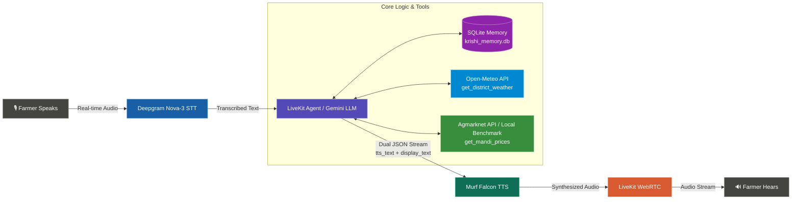

# 🌾 Krishi Mitra — AI Voice Advisor for Indian Farmers

**Krishi Mitra (कृषि मित्र)** is a production-grade, real-time multilingual voice AI assistant built specifically for Indian farmers. Powered by **Murf Falcon TTS**, **LiveKit Agents SDK**, **Deepgram Nova-3 STT**, **Google Gemini 3.1 Flash Lite LLM**, **SQLite Persistent Memory**, and **Real-Time External APIs** (Open-Meteo Weather + Government Agmarknet Mandi Prices).

[](https://opensource.org/licenses/MIT)
[](https://murf.ai/api/docs/text-to-speech/streaming)
[](https://docs.livekit.io)
[](https://nextjs.org/)
[](https://www.python.org/)

---

## 🚀 Key Capabilities

- 🗣️ **Natural Multilingual Voice Interaction**: Communicates fluently in **English**, **Devanagari Hindi**, and **Bengali** with 100% strict language-matching rules.
- ⚡ **Ultra-Low Latency Speech Pipeline**: Powered by Murf Falcon TTS (55ms latency) and Deepgram Nova-3 STT with Silero VAD turn detection for smooth, stutter-free natural conversation.
- 🧠 **Persistent SQLite Memory**: Remembers returning farmers by name, location, crops, and last discussed topics across sessions with zero startup lag.
- 🛡️ **Explicit Consent & Privacy Protocol**: Asks explicit user consent before storing personal information, with built-in data deletion tools (`forget_farmer_facts`).
- 🌦️ **Real-Time District Weather**: Integrates Open-Meteo Geocoding & Weather Forecast APIs (`get_district_weather`) for temperature, rainfall (mm), and agricultural weather forecasts.
- 🌾 **Live Agmarknet Mandi Prices**: Fetches real-time crop wholesale rates from Government OGD India API (`data.gov.in`) with a 3.0s timeout and a local benchmark fallback dataset (`mandi_rates.json`).

---

## 🏗️ System Architecture



---

## 📅 Daily Feature Breakdown (Day 1 – Day 5)

### 🔹 Day 1: Core Voice AI Pipeline
- Established initial voice agent pipeline connecting LiveKit RTC transport, Deepgram STT, Google Gemini LLM, and Murf Falcon TTS.
- Implemented agricultural advisor identity for Krishi Mitra with base system prompts.

### 🔹 Day 2: Audio Polish, STT Tuning & Visualizer Enhancements
- **Audio Clutter & Rumbling Resolution**: Integrated Murf `SentenceTokenizer` and streaming audio buffers, eliminating micro-chunk audio stutters.
- **Silero VAD Tuning**: Fine-tuned voice activity detection (`min_silence_duration=1.2s`, `min_speech_duration=0.2s`) to accommodate natural pauses in Indian speech.
- **Multilingual Keyterm Dictionary**: Added agricultural keyterms in English, Hindi, and Bengali to Deepgram Nova-3 for higher STT accuracy.
- **UI Enhancements**: Added dynamic header slide animation (`cubic-bezier`) during active calls and tuned the voice visualizer (`50Hz–3400Hz`) to capture full vocal spectrums.

### 🔹 Day 3: Dual-Output JSON Streaming & Multilingual Precision
- **Dual-Output Protocol**: Configured LLM to output a valid JSON object containing `tts_text` (synthesized audio) and `display_text` (screen transcript).
- **Strict Language Matching**: Enforced strict language matching rules (English queries $\rightarrow$ 100% pure English text & audio, Hindi $\rightarrow$ Devanagari Hindi, Bengali $\rightarrow$ Bengali script).
- **Off-Topic Guardrails**: Implemented dynamic refusal responses for non-agricultural queries.

### 🔹 Day 4: Persistent SQLite Memory & Consent Protocol
- **SQLite Database (`krishi_memory.db`)**: Built profile storage tracking farmer names, crops grown, land size, district, topic, and language preferences.
- **Instant Returning Greetings**: Pre-loaded profiles upon WebRTC connection so returning farmers are greeted instantly by name (*"Hello Arpan! Last time we spoke about your paddy..."*) with zero latency.
- **Explicit Consent Protocol**: Krishi Mitra answers queries first, then explicitly asks permission before saving personal information.
- **Forget Memory Tool**: Added `@function_tool forget_farmer_facts` allowing users to delete all stored profile data on demand.

### 🔹 Day 5: Dual Real-Time External Tools (Weather + Mandi Prices)
- **Tool 1 (`get_district_weather`)**: Integrates Open-Meteo Geocoding & Forecast APIs to return current temperature, daily min/max range, and rainfall forecasts (mm) for any district.
- **Tool 2 (`get_mandi_prices`)**: Fetches live commodity wholesale rates from Government Agmarknet / OGD India API (`data.gov.in`) with a **strict 3.0s timeout**.
- **Local Benchmark Fallback (`mandi_rates.json`)**: Created local fallback dataset for key commodities (Paddy, Rice, Potato, Jute, Mustard, Wheat, Onion, Maize, Cotton) to ensure call stability if government APIs time out.
- **Timestamp & Mandi Guardrails**: Mandi reports explicitly disclose dates and advise farmers to verify rates at local markets before selling.

---

## 🛠️ Tech Stack

- **Backend**: Python 3.11+, LiveKit Agents SDK (`livekit-agents ~1.4`), SQLite3, `httpx`, `uv`
- **Speech-to-Text (STT)**: Deepgram Nova-3 (Multilingual + Custom Indic Keyterm Boosting)
- **LLM**: Google Gemini 3.1 Flash Lite (`livekit-plugins-google`)
- **Text-to-Speech (TTS)**: Murf Falcon (`livekit-plugins-murf`, Anisha voice)
- **Voice Activity & Turn Detection**: Silero VAD + LiveKit Multilingual Turn Detector
- **Frontend**: Next.js 14, React, TypeScript, Tailwind CSS, LiveKit Agents UI Components

---

## ⚙️ Prerequisites & Environment Setup

### Prerequisites
- **Python 3.10+** with `uv` package manager:
  ```bash
  powershell -ExecutionPolicy ByPass -c "irm https://astral.sh/uv/install.ps1 | iex"
  ```
- **Node.js 18+** with `pnpm`:
  ```bash
  npm install -g pnpm
  ```
- A **[LiveKit Cloud](https://cloud.livekit.io/)** account.

### Environment Variables
Copy `.env.example` to `.env.local` in `backend/` and `frontend/`:

```env
# LiveKit
LIVEKIT_URL=wss://your-project.livekit.cloud
LIVEKIT_API_KEY=your_api_key
LIVEKIT_API_SECRET=your_api_secret

# AI Models & Speech
MURF_API_KEY=your_murf_api_key
DEEPGRAM_API_KEY=your_deepgram_api_key
GOOGLE_API_KEY=your_gemini_api_key

# External Market API (Day 5)
DATA_GOV_API_KEY=your_agmarknet_api_key
```

---

## 🏃 Running Locally

### Option A: All-in-One Startup Script

```bash
# Windows (PowerShell)
.\start_app.ps1

# macOS/Linux
chmod +x start_app.sh
./start_app.sh
```

### Option B: Separate Terminals

```bash
# Terminal 1: Backend Agent
cd backend
uv sync
uv run python src/agent.py dev

# Terminal 2: Frontend UI
cd frontend
pnpm install
pnpm dev
```

Open **http://localhost:3000** in your browser, click **Start talking**, and converse with Krishi Mitra!

---

## 📁 Repository Structure

```
murf-livekit-starter/
├── backend/
│   ├── src/
│   │   ├── agent.py          # Entrypoint — LiveKit voice pipeline & system prompt
│   │   ├── tools.py          # Day 5 tools (Open-Meteo Weather & Agmarknet Mandi)
│   │   ├── db.py             # SQLite profile memory management
│   │   └── mandi_rates.json  # Benchmark market fallback rates
│   ├── tests/                # Async pytest suite (14 passing tests)
│   ├── krishi_memory.db      # SQLite database file
│   └── pyproject.toml        # Backend dependencies & Ruff config
├── frontend/
│   ├── app/                  # Next.js pages & LiveKit token API route
│   ├── components/           # Voice visualizer, controls, header animations
│   └── app-config.ts         # Branding, accent colors, and app metadata
├── start_app.ps1             # Windows startup script
├── start_app.sh              # Linux/macOS startup script
└── README.md                 # Project documentation
```

---

## 🧪 Testing & Code Quality

Run automated unit and integration tests:

```bash
cd backend
uv run pytest                  # Run all 14 backend test cases
uv run ruff check .            # Linting
uv run ruff format .           # Code formatting
```

---

## 📄 License

Distributed under the MIT License. See `LICENSE` for details.
